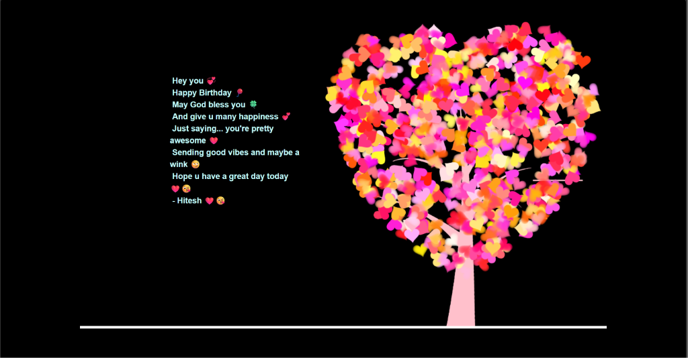

<p align="center">
  
</p>

<h1 align="center">🎂 Birthday Wish — An Animated Love Letter 💕</h1>

<p align="center">
  <em>A beautiful, interactive birthday wish webpage with a blooming cherry blossom tree, typewriter messages, and heartfelt vibes ✨</em>
</p>

<p align="center">
  <a href="https://github.com/hiteshraj786/birthday-project/blob/main/LICENSE">
    
  </a>
  
  
</p>

<p align="center">
  <strong>🌟 <a href="https://birthday-project-a5jj.onrender.com">View Live Demo</a> 🌟</strong>
</p>

---

## ✨ What Is This?

This is a **handcrafted, animated birthday wish** built as a single-page web experience. Click the seed, watch a cherry blossom tree bloom to life, and let the heartfelt birthday messages reveal themselves one character at a time — all set to a beautiful background soundtrack.

> *Because some birthdays deserve more than just a text message.* 💌

---

## 🎬 How It Works

1. 🌱 **A seed appears** on a dark canvas — click it to begin the magic
2. 🌳 **A cherry blossom tree grows** branch by branch with smooth canvas animations
3. 🌸 **Flowers bloom** across the tree with beautiful pink and red petals
4. ✍️ **Birthday messages appear** with a typewriter effect, one letter at a time
5. 🎵 **Background music plays** to set the perfect mood

---

## 🖼️ Preview

<p align="center">
  
</p>

---

## 🛠️ Tech Stack

| Technology | Purpose |
|---|---|
| **HTML5 Canvas** | Tree growth & flower bloom animations |
| **jQuery** | DOM manipulation & event handling |
| **Jscex (Wind.js)** | Async animation sequencing |
| **Vanilla CSS** | Dark theme styling |
| **JavaScript** | Typewriter effect, timer, interactions |

---

## 🚀 Getting Started

### Prerequisites

- Any modern web browser (Chrome, Firefox, Edge, Safari)
- No build tools or servers needed — it's pure HTML/CSS/JS!

### Run Locally

```bash
# Clone the repository
git clone https://github.com/hiteshraj786/birthday-project.git

# Navigate to the project
cd birthday-project/her-birthday

# Open in your browser
start index.html        # Windows
open index.html         # macOS
xdg-open index.html     # Linux
```

> 💡 **Tip:** For the best experience, use a Chromium-based browser and ensure your volume is on for the background music 🎶

---

## 📁 Project Structure

```
birthday-project/
├── her-birthday/
│   ├── index.html          # 🎯 Main entry point
│   ├── aud.mp3             # 🎵 Background music
│   ├── img.png             # 🖼️ Preview image 1
│   ├── img2.png            # 🖼️ Preview image 2
│   └── file/
│       ├── default.css     # 🎨 Styles & dark theme
│       ├── function.js     # ⌨️ Typewriter effect & timer
│       ├── love.js         # 🌳 Tree, bloom & petal animations
│       ├── jquery.min.js   # 📦 jQuery library
│       └── jscex-*.js      # ⚡ Async animation engine
├── .gitignore
├── LICENSE                 # MIT License
└── README.md               # 📖 You are here!
```

---

## 🎨 Features at a Glance

- 🌸 **Animated Cherry Blossom Tree** — Grows organically on an HTML5 Canvas
- ✍️ **Typewriter Text Effect** — Messages revealed character by character with a blinking cursor
- 🎵 **Background Music** — Auto-plays a sweet audio track to set the mood
- 🌙 **Dark Theme** — Elegant black background that makes the colors pop
- 🖱️ **Interactive Start** — Click the seed to trigger the entire animation sequence
- 🌺 **Falling Petals** — 700+ bloom particles scattered across the canvas

---

## 💡 Customization

Want to make it your own? Here's how:

| What to Change | Where |
|---|---|
| Birthday messages | `index.html` → Lines 33-40 (`<span class="say">`) |
| Background music | Replace `her-birthday/aud.mp3` with your audio file |
| Tree colors/shape | `index.html` → `opts` object (lines 64-98) |
| Text styling | `file/default.css` → `#code` selector |
| Number of blooms | `index.html` → `opts.bloom.num` (line 89) |

---

## 📜 License

This project is licensed under the **MIT License** — see the [LICENSE](LICENSE) file for details.

---

<p align="center">
  Made with lots of ❤️ by <a href="https://github.com/hiteshraj786">Hitesh</a>
</p>

<p align="center">
  <em>⭐ Star this repo if it made you smile!</em>
</p>